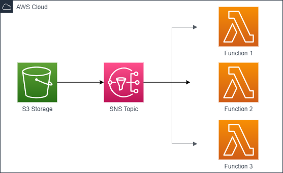

# Serverless Fanout using Amazon SNS and Amazon Lambda

## 🏠 Architecture

With the help of. [Messaging Fanout Pattern for Serverless Architectures Using Amazon SNS.](https://aws.amazon.com/blogs/compute/messaging-fanout-pattern-for-serverless-architectures-using-amazon-sns/)

